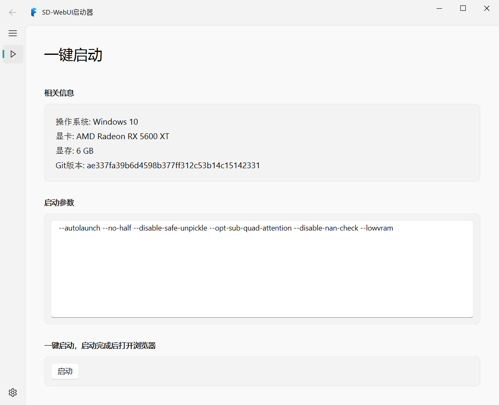

# Stable Diffusion WebUI Launcher - DirectML

[](https://www.gnu.org/licenses/gpl-3.0)



This is a PyQt5 based launcher for Stable Diffusion WebUI DirectML. The launcher uses the PyQt-Fluent-Widgets library for a modern and visually appealing interface.

## Installation

To use the Stable Diffusion WebUI Launcher with DirectML, you must have Python3 and DirectML installed on your system. You can install Python3 using your operating system's package manager or by downloading it from the official website.

Once you have Python3 installed, you can install the required dependencies using the following command:

```bash
pip install PyQt5 "PyQt-Fluent-Widgets[full]"
```

## Usage

To launch the Stable Diffusion WebUI Launcher, navigate to the directory containing the `main.py` file and run the following command:

```bash
python ./main.py
```

The launcher will open, and you can use it to launch Stable Diffusion WebUI with DirectML support.

## Development

The Stable Diffusion WebUI Launcher is still in development. Contributions are welcome! If you want to contribute, please fork the repository and submit a pull request with your changes.

repositories:

- Stable Diffusion WebUI DirectML: https://github.com/lshqqytiger/stable-diffusion-webui-directml
- PyQt-Fluent-Widgets: https://github.com/zhiyiYo/PyQt-Fluent-Widgets
